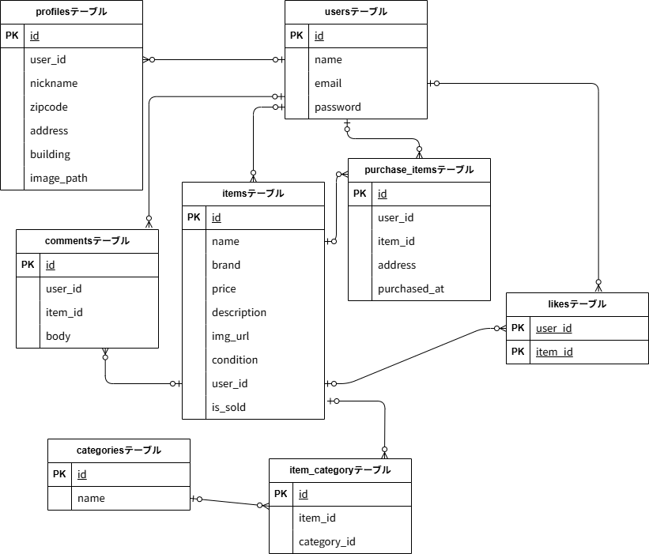

環境構築

Dockerビルド

・git clone git@github.com:qliangtai34/Market.git
・docker-compose up -d --build

Laravel環境構築

・docker-compose exec php bash
・composer install
・.env.exampleファイルから.envを作成し、環境変数を変更 
・php artisan key:generate
・php artisan migrate
・php artisan db:seed

開発環境

・商品一覧画面：http://localhost/
・ユーザー登録：http://localhost/register
・phpMyAdmin：http://localhost:8080/index.php?route=/database/structure&db=laravel_db

使用技術（実行環境）

・PHP 7.4.9
・Laravel 8.83.29
・MySQL  15.1
・nginx　1.21.1

ER図

